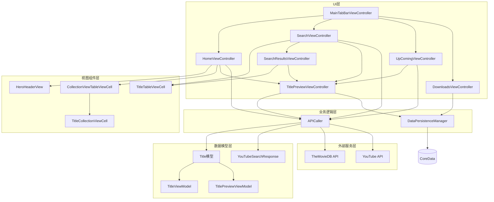
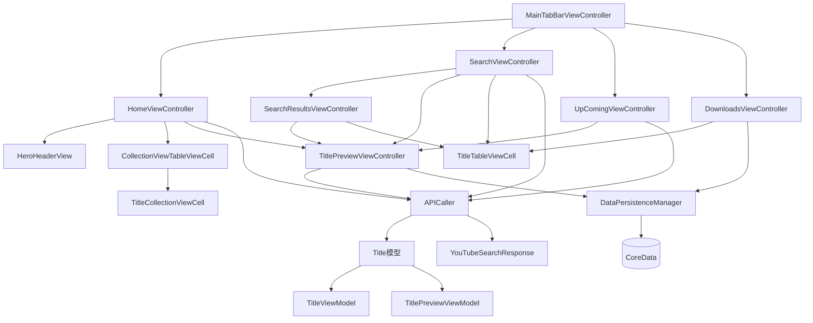
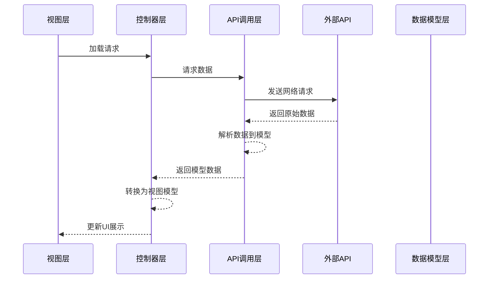
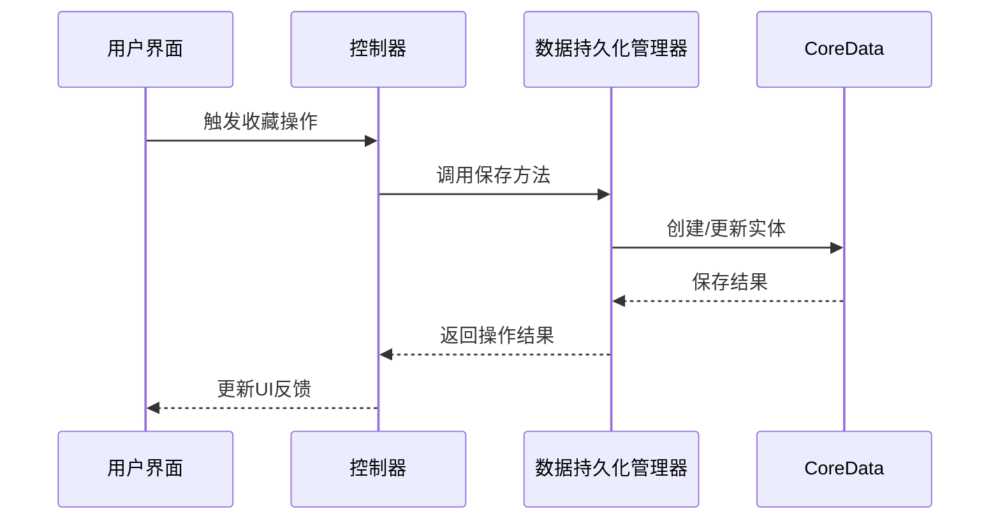
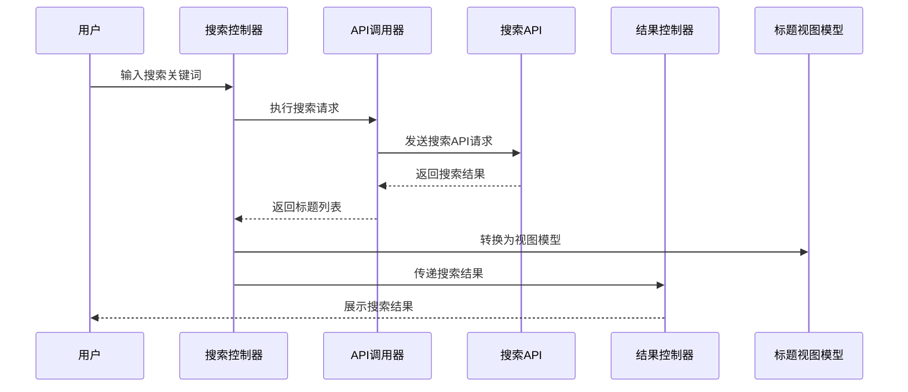

# Netflix-Clone 项目设计文档

## 1. 整体架构图



## 2. 分层设计和核心组件

### 2.1 分层架构

#### UI层 (控制器层)
- **MainTabBarViewController**: 应用的根控制器，管理底部标签导航和四个主要功能页面
- **核心控制器组 (Core Controllers)**: 
  - `HomeViewController`: 首页，展示各类内容列表和英雄区
  - `SearchViewController`: 搜索页面，提供内容搜索功能
  - `UpComingViewController`: 即将上映页面
  - `DownloadsViewController`: 下载/收藏管理页面
- **通用控制器组 (General Controllers)**: 
  - `TitlePreviewViewController`: 内容详情和预览页面
  - `SearchResultsViewController`: 搜索结果展示页面

#### 视图组件层
- **HeroHeaderView**: 首页顶部的大型英雄区展示组件
- **CollectionViewTableViewCell**: 嵌套在TableView中的CollectionView容器，用于横向滚动内容列表
- **TitleCollectionViewCell**: 横向滚动列表中的单个内容项
- **TitleTableViewCell**: 表格视图中的内容项，用于搜索结果和发现页

#### 业务逻辑层
- **APICaller**: 负责所有网络请求，与TheMovieDB和YouTube API交互
- **DataPersistenceManager**: 管理本地数据持久化，使用CoreData存储收藏内容

#### 数据模型层
- **数据模型**: `Title`, `YouTubeSearchResponse` 等原始数据模型
- **视图模型**: `TitleViewModel`, `TitlePreviewViewModel` 等，用于UI展示的数据转换模型

#### 外部服务层
- TheMovieDB API: 提供电影和电视剧数据
- YouTube API: 提供视频搜索功能
- CoreData: 本地数据存储

## 3. 模块依赖关系图



## 4. 接口契约定义

### 4.1 APICaller 接口

```swift
// 热门电影获取
getTrendingMovies(completion: @escaping (Result<[Title], Error>) -> Void)

// 热门电视剧获取（使用Combine）
getTrendingTvs() -> AnyPublisher<[Title], Error>

// 即将上映电影获取
getUpcomingMovies(completion: @escaping (Result<[Title], Error>) -> Void)

// 流行电影获取
getPopular(completion: @escaping (Result<[Title], Error>) -> Void)

// 高评分电影获取
getTopRated(completion: @escaping (Result<[Title], Error>) -> Void)

// 发现电影获取
getDiscoverMovies(completion: @escaping (Result<[Title], Error>) -> Void)

// 内容搜索
search(with query: String, completion: @escaping (Result<[Title], Error>) -> Void)

// YouTube视频搜索
getMovie(with query: String, completion: @escaping (Result<VideoElement, Error>) -> Void)
```

### 4.2 DataPersistenceManager 接口

```swift
// 保存内容到本地
downloadTitleWith(model: Title, completion: @escaping (Result<Void, Error>) -> Void)

// 从本地获取所有收藏内容
fetchingTitlesFromDatabase(completion: @escaping (Result<[TitleItem], Error>) -> Void)

// 从本地删除收藏内容
deleteTitleFromDatabase(titleItem: TitleItem, completion: @escaping (Result<Void, Error>) -> Void)
```

### 4.3 视图模型接口

#### TitleViewModel
```swift
struct TitleViewModel {
    let titleName: String
    let posterURL: String
}
```

#### TitlePreviewViewModel
```swift
struct TitlePreviewViewModel {
    let title: String
    let youtubeView: VideoElement
    let titleOverview: String
}
```

### 4.4 代理接口

#### CollectionViewTableViewCellDelegate
```swift
protocol CollectionViewTableViewCellDelegate: AnyObject {
    func collectionViewTableViewCellDidTapCell(_ cell: CollectionViewTableViewCell, viewModel: TitlePreviewViewModel)
}
```

## 5. 数据流向图

### 5.1 内容获取与展示流程



### 5.2 内容收藏/下载流程



### 5.3 搜索流程



## 6. 异常处理策略

### 6.1 网络请求异常处理

- **超时处理**: 设置合理的请求超时时间
- **重试机制**: 针对特定错误实现有限次数的自动重试
- **错误分类**: 
  - `APIError.failedToGetData`: 数据获取失败
  - `APIError.invalidURL`: URL格式错误
- **用户反馈**: 网络错误时提供适当的UI提示

### 6.2 数据持久化异常处理

- **错误分类**: 
  - `DataPersistenceError.failedToSaveData`: 保存失败
  - `DataPersistenceError.failedToFetchData`: 获取失败
  - `DataPersistenceError.failedToDeleteData`: 删除失败
- **事务完整性**: 确保数据操作的原子性
- **用户反馈**: 操作失败时提供清晰的错误信息

### 6.3 UI异常处理

- **空状态处理**: 数据加载为空时显示适当的占位视图
- **加载状态**: 数据加载过程中显示加载指示器
- **错误状态**: 数据加载失败时显示错误视图和重试选项
- **内存警告**: 响应内存警告，释放不必要的资源

## 7. 性能优化策略

### 7.1 网络请求优化

- **请求缓存**: 实现合理的缓存策略，减少重复请求
- **并发请求**: 关键页面数据并行加载
- **分页加载**: 大量数据采用分页加载策略
- **请求合并**: 避免短时间内发送过多相似请求

### 7.2 UI性能优化

- **图片加载优化**: 使用SDWebImage进行图片异步加载和缓存
- **视图复用**: 充分利用UICollectionView和UITableView的视图复用机制
- **延迟加载**: 非可视区域内容延迟加载
- **异步处理**: 耗时操作放在后台线程执行，避免阻塞主线程

### 7.3 内存管理优化

- **弱引用**: 适当使用weak引用避免循环引用
- **资源释放**: 视图控制器销毁时释放相关资源
- **大型对象管理**: 避免持有不必要的大型对象引用
- **懒加载**: 延迟初始化非必要对象

## 8. 扩展性设计

### 8.1 功能扩展

- **新内容类型**: 设计支持轻松添加新的内容分类和展示方式
- **新API集成**: 预留接口便于集成新的外部服务
- **主题切换**: 架构设计支持未来实现深色/浅色主题切换

### 8.2 技术扩展

- **模块化设计**: 关键功能模块化，便于替换和升级
- **依赖注入**: 便于测试和功能替换
- **抽象接口**: 核心组件使用协议定义接口，便于实现替换

### 8.3 维护性设计

- **代码规范**: 遵循Swift编码规范，提高代码可读性
- **注释完善**: 关键功能和复杂逻辑添加适当注释
- **日志记录**: 关键操作和错误情况进行日志记录
- **错误追踪**: 实现错误上报机制，便于问题定位