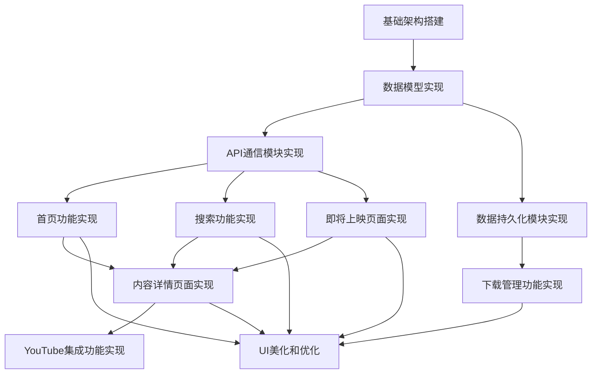

# Netflix-Clone 项目任务分解文档

## 1. 任务依赖图

## 2. 原子任务定义

### 任务1: 基础架构搭建

**输入契约**:
- Xcode项目创建
- iOS开发环境配置
- CocoaPods设置

**输出契约**:
- 基础Xcode项目结构
- 配置完成的Podfile和依赖
- AppDelegate和SceneDelegate基础实现
- MainTabBarViewController框架

**实现约束**:
- 使用Swift 5.0+
- 支持iOS 14.0+
- 集成SDWebImage库
- 遵循MVC架构模式

**依赖关系**:
- 前置任务: 无
- 后置任务: 任务2, 任务3, 任务4

### 任务2: 数据模型实现

**输入契约**:
- API响应数据结构
- 应用展示需求
- CoreData实体设计

**输出契约**:
- Title模型结构体
- YouTubeSearchResponse模型结构体
- TitleViewModel和TitlePreviewViewModel
- CoreData实体模型

**实现约束**:
- 遵循Codable协议
- 支持JSON解析
- 属性命名与API响应一致
- 支持CoreData持久化

**依赖关系**:
- 前置任务: 任务1
- 后置任务: 任务3, 任务4, 任务5, 任务6, 任务7, 任务8, 任务9

### 任务3: API通信模块实现

**输入契约**:
- TMDB API文档
- YouTube API文档
- API密钥
- Title模型定义

**输出契约**:
- APICaller单例类
- 热门电影获取方法
- 热门电视剧获取方法（Combine）
- 即将上映电影获取方法
- 流行电影获取方法
- 高评分电影获取方法
- 发现电影获取方法
- 内容搜索方法
- YouTube视频搜索方法
- 错误处理机制

**实现约束**:
- 混合使用回调和Combine
- 实现完整的错误处理
- 支持请求取消
- API密钥管理

**依赖关系**:
- 前置任务: 任务1, 任务2
- 后置任务: 任务5, 任务6, 任务7, 任务9

### 任务4: 数据持久化模块实现

**输入契约**:
- CoreData模型配置
- Title模型定义

**输出契约**:
- DataPersistenceManager单例类
- 内容保存方法
- 内容获取方法
- 内容删除方法
- 错误处理机制

**实现约束**:
- 使用CoreData进行本地存储
- 实现完整的错误处理
- 线程安全考虑

**依赖关系**:
- 前置任务: 任务1, 任务2
- 后置任务: 任务8, 任务9

### 任务5: 首页功能实现

**输入契约**:
- HomeViewController框架
- HeroHeaderView组件
- CollectionViewTableViewCell组件
- APICaller实现

**输出契约**:
- 完整的HomeViewController实现
- 英雄区展示功能
- 横向滚动列表展示
- 导航栏配置
- 数据加载和UI更新

**实现约束**:
- 支持多种内容类型展示
- 流畅的滚动体验
- 响应式UI布局

**依赖关系**:
- 前置任务: 任务3, 任务10
- 后置任务: 任务9

### 任务6: 搜索功能实现

**输入契约**:
- SearchViewController框架
- SearchResultsViewController框架
- TitleTableViewCell组件
- APICaller实现

**输出契约**:
- 完整的SearchViewController实现
- 搜索框配置和功能
- 搜索结果展示
- 发现电影推荐
- 搜索结果到详情页的导航

**实现约束**:
- 实时搜索反馈
- 合理的空状态和错误状态

**依赖关系**:
- 前置任务: 任务3, 任务10
- 后置任务: 任务9

### 任务7: 即将上映页面实现

**输入契约**:
- UpComingViewController框架
- APICaller实现
- 列表展示组件

**输出契约**:
- 完整的UpComingViewController实现
- 即将上映电影列表展示
- 列表项点击功能

**实现约束**:
- 与首页列表风格一致
- 适当的加载状态

**依赖关系**:
- 前置任务: 任务3, 任务10
- 后置任务: 任务9

### 任务8: 下载管理功能实现

**输入契约**:
- DownloadsViewController框架
- DataPersistenceManager实现
- 列表展示组件

**输出契约**:
- 完整的DownloadsViewController实现
- 已收藏内容列表展示
- 删除收藏功能
- 收藏状态管理

**实现约束**:
- 支持批量操作
- 实时更新列表

**依赖关系**:
- 前置任务: 任务4, 任务10

### 任务9: 内容详情页面实现

**输入契约**:
- TitlePreviewViewController框架
- APICaller实现
- DataPersistenceManager实现
- YouTube集成功能

**输出契约**:
- 完整的TitlePreviewViewController实现
- 内容详情展示
- 播放按钮功能
- 下载/收藏按钮功能
- YouTube预告片信息展示

**实现约束**:
- 响应式布局
- 良好的错误处理

**依赖关系**:
- 前置任务: 任务3, 任务4, 任务10, 任务11

### 任务10: UI组件实现

**输入契约**:
- UI设计规范
- 各控制器需求

**输出契约**:
- HeroHeaderView组件
- CollectionViewTableViewCell组件
- TitleCollectionViewCell组件
- TitleTableViewCell组件
- 布局约束和样式

**实现约束**:
- 支持不同屏幕尺寸
- 符合iOS设计规范
- 性能优化

**依赖关系**:
- 前置任务: 任务2
- 后置任务: 任务5, 任务6, 任务7, 任务8

### 任务11: YouTube集成功能实现

**输入契约**:
- YouTube API实现
- 视频播放需求

**输出契约**:
- 视频搜索功能
- 视频信息解析
- 视频播放准备

**实现约束**:
- 支持视频URL获取
- 错误处理
- 性能优化

**依赖关系**:
- 前置任务: 任务3
- 后置任务: 任务9

### 任务12: UI美化和优化

**输入契约**:
- 各功能模块实现
- UI优化需求

**输出契约**:
- 统一的视觉风格
- 动画效果实现
- 加载状态和错误状态优化
- 性能优化

**实现约束**:
- 符合Netflix风格
- 流畅的用户体验
- 可访问性支持

**依赖关系**:
- 前置任务: 任务5, 任务6, 任务7, 任务8, 任务9

## 3. 任务验收标准

### 任务1: 基础架构搭建
- ✅ Xcode项目能够成功编译运行
- ✅ Pod依赖正确安装
- ✅ TabBarController正确配置四个主要标签
- ✅ 应用启动流程正常

### 任务2: 数据模型实现
- ✅ 模型能够正确解析API响应
- ✅ 视图模型能够正确转换数据用于UI展示
- ✅ CoreData实体能够正确映射模型
- ✅ 模型属性完整且符合需求

### 任务3: API通信模块实现
- ✅ 能够成功获取各类内容数据
- ✅ 错误处理机制正常工作
- ✅ 请求能够正确取消
- ✅ Combine和回调方法都能正常工作

### 任务4: 数据持久化模块实现
- ✅ 能够成功保存内容到本地
- ✅ 能够正确读取已保存内容
- ✅ 能够成功删除内容
- ✅ 错误处理机制正常工作

### 任务5: 首页功能实现
- ✅ 英雄区正确显示随机热门电影
- ✅ 多个横向滚动列表正确展示不同分类内容
- ✅ 点击内容项能正确跳转到详情页
- ✅ 滚动流畅，UI响应及时

### 任务6: 搜索功能实现
- ✅ 搜索框正常工作，支持关键词输入
- ✅ 搜索结果正确显示
- ✅ 发现电影推荐正常显示
- ✅ 搜索结果项点击能正确跳转到详情页

### 任务7: 即将上映页面实现
- ✅ 即将上映电影列表正确显示
- ✅ 列表项点击能正确跳转到详情页
- ✅ 加载状态和错误状态处理合理

### 任务8: 下载管理功能实现
- ✅ 已收藏内容列表正确显示
- ✅ 删除功能正常工作
- ✅ 列表能够实时更新
- ✅ 空状态显示合理

### 任务9: 内容详情页面实现
- ✅ 内容详情信息正确显示
- ✅ 下载/收藏按钮功能正常
- ✅ YouTube预告片信息正确获取
- ✅ 返回导航正常

### 任务10: UI组件实现
- ✅ 各组件能够正确显示和布局
- ✅ 支持不同屏幕尺寸适配
- ✅ 组件复用机制正常工作
- ✅ 图片加载和缓存正常

### 任务11: YouTube集成功能实现
- ✅ 能够成功搜索视频
- ✅ 能够正确解析视频信息
- ✅ 视频信息能够传递给播放器
- ✅ 错误处理机制正常工作

### 任务12: UI美化和优化
- ✅ 整体视觉风格统一且符合Netflix风格
- ✅ 动画效果流畅自然
- ✅ 加载状态和错误状态UI友好
- ✅ 应用性能满足要求，无明显卡顿

## 4. 风险评估

| 任务编号 | 风险描述 | 影响程度 | 缓解措施 |
|---------|---------|---------|--------|
| 3 | API密钥安全风险 | 高 | 建议使用环境变量或加密存储，避免硬编码 |
| 3, 11 | API调用限制 | 中 | 实现请求缓存和重试机制，监控API使用情况 |
| 9 | 视频播放功能未完全实现 | 中 | 明确当前仅实现视频搜索，未来可扩展为完整播放器 |
| 10 | UI性能优化挑战 | 中 | 使用异步加载、视图复用和缓存机制 |
| 整体 | 缺少单元测试 | 中 | 建议逐步添加关键功能的单元测试 |
| 整体 | 缺少用户认证系统 | 低 | 明确当前为匿名用户模式，未来可扩展认证功能 |